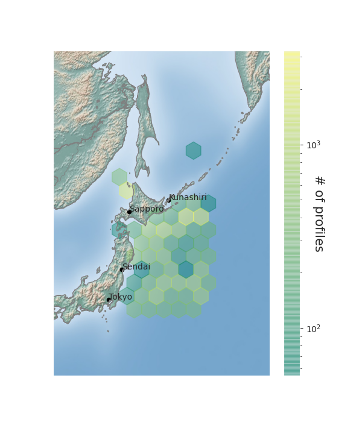
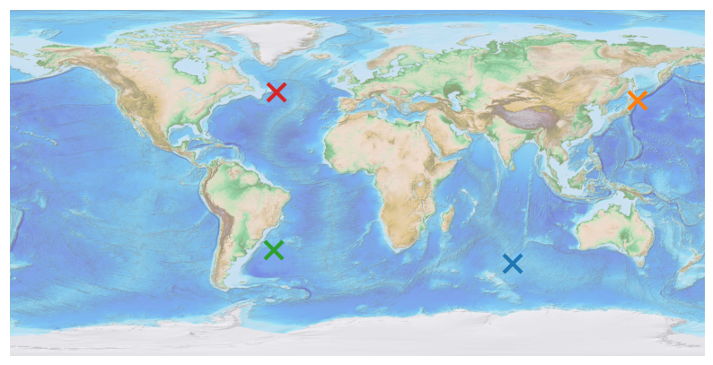
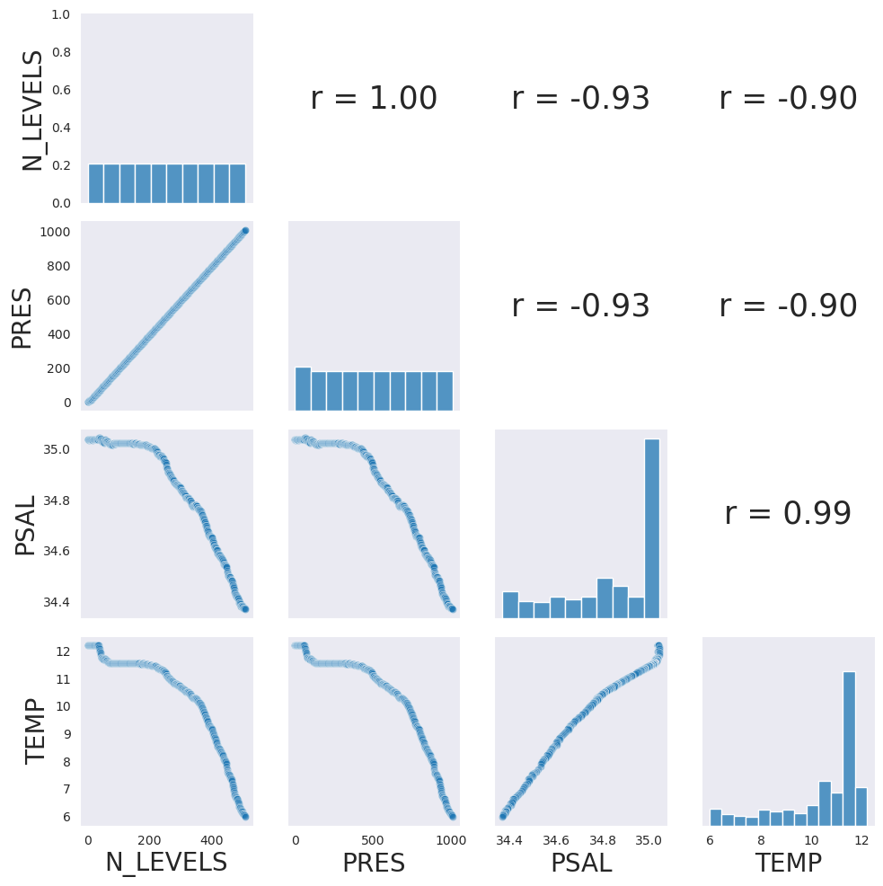
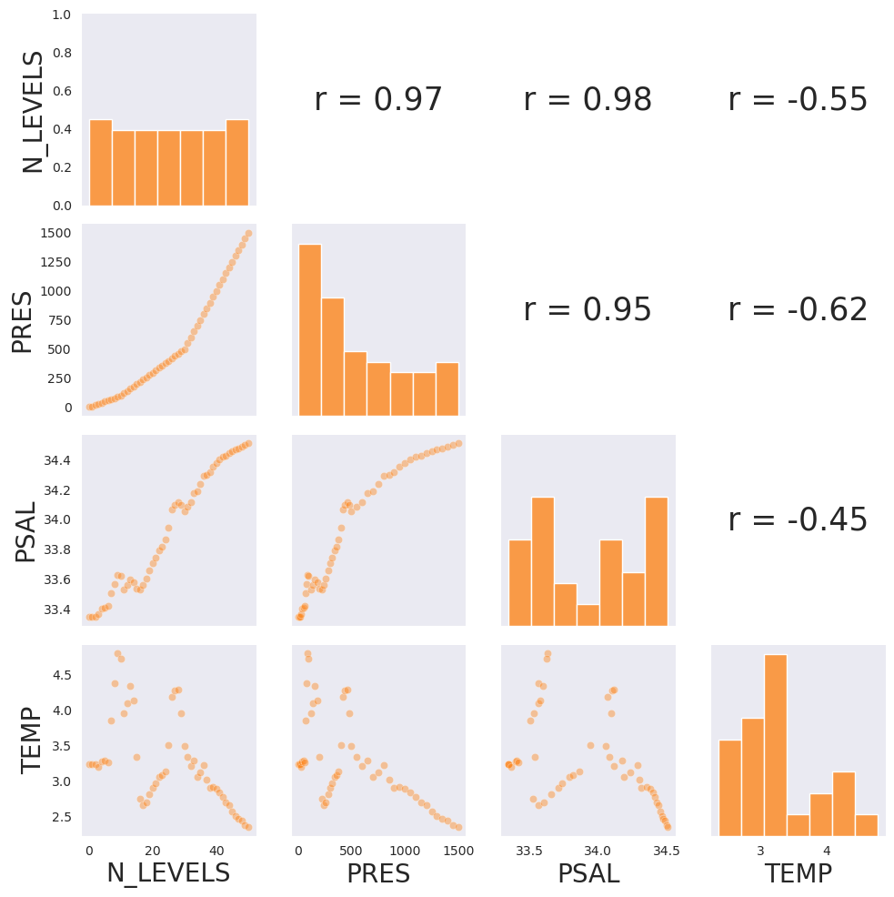
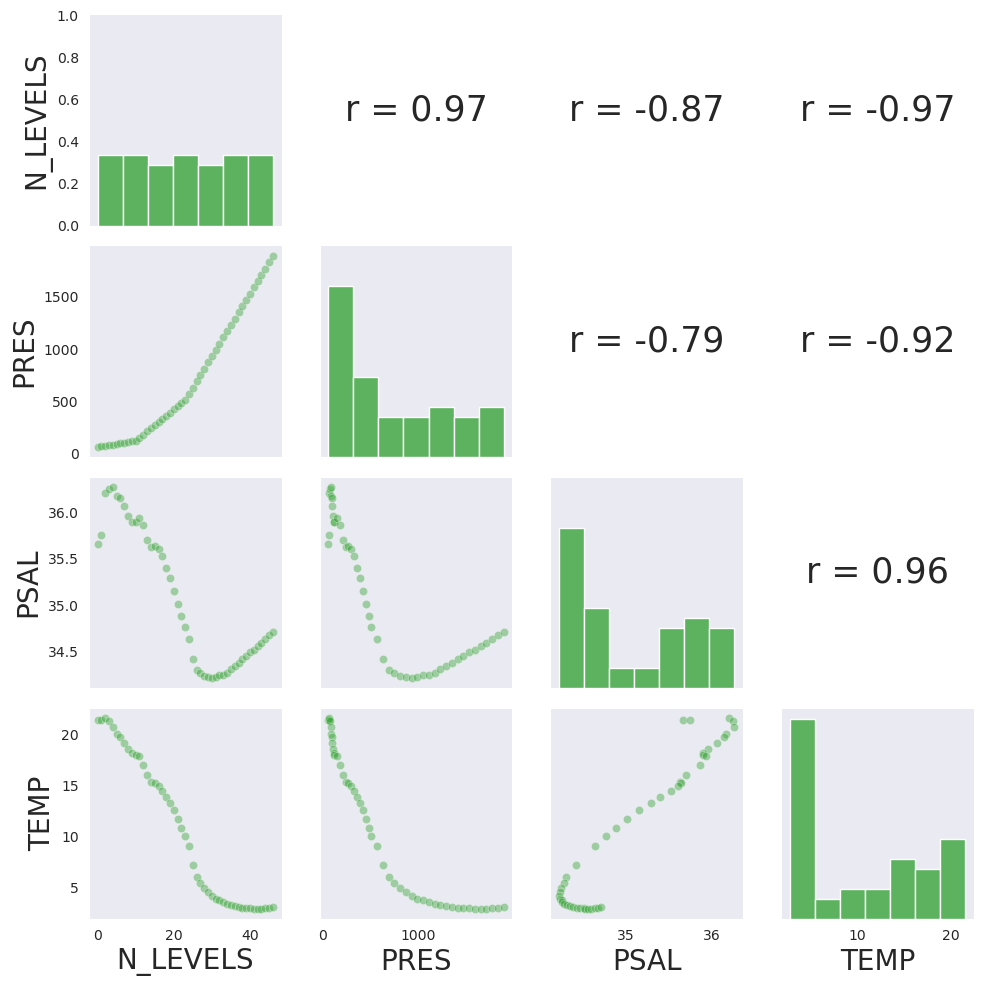
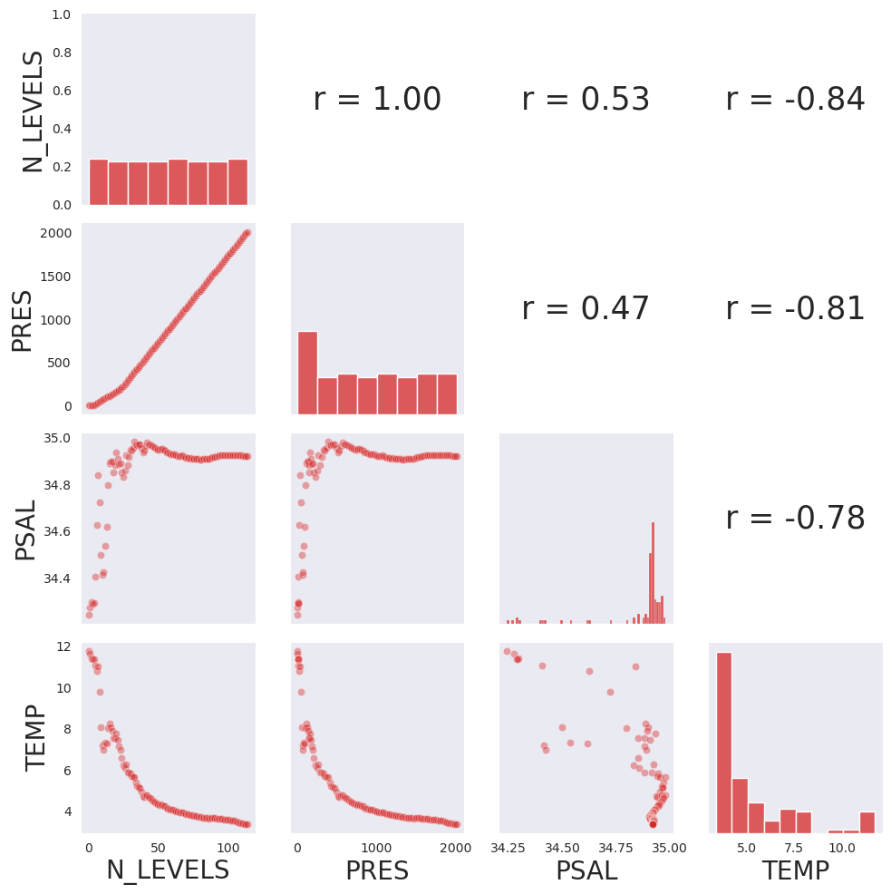

# CMSC6950_Project
Course project for CMSC6950 Spring 2021

Yashar Tavakoli

## Software setup

argopy dependencies:

```
conda install xarray fsspec scikit-learn erddapy gsw aiohttp netCDF4 dask toolz
conda install ipython ipywidgets tqdm matplotlib cartopy seaborn
```
argopy itself:

```
conda install -c conda-forge argopy
```

other dependencies of the project:

```
conda install numpy scipy pandas basemap
conda install -c conda-forge basemap-data-hires
conda install geoplot -c conda-forge
conda install -c conda-forge geopandas
```

## Computational Tasks

**Task no.1** - Density of the argos within certain geographical and time boundaries.



**Task no.2** - Correlation study of variables pertaining to arbitrary profiles of four argos, using scatter-plot, histogram, and Pearson's r coefficient.



   
   