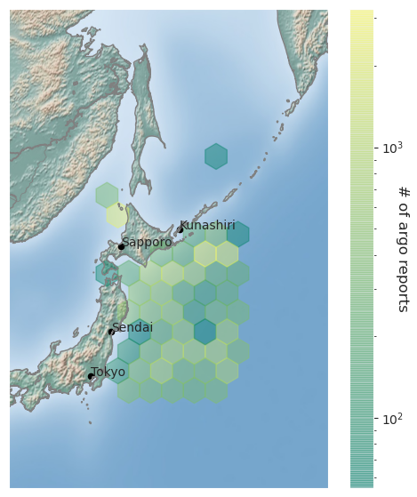

# CMSC6950_Project
Course project for CMSC6950 Spring 2021

Yashar Tavakoli

## Software setup

```
conda create --name argopy
conda activate argopy
conda init

conda install ipython ipywidgets tqdm matplotlib cartopy seaborn
conda install basemap
conda install -c conda-forge basemap-data-hires
conda install geoplot -c conda-forge
conda install -c conda-forge geopandas

```
## Computational Tasks

**Task no.1** - Density of the argos within certain geographical and time boundaries (more details in the report).



**Task no.2** - Correlation study of variables pertaining to arbitrary profiles of four argos, using scatter-plot, histogram, and Pearson's r coefficient(more details in the report).

   
   
